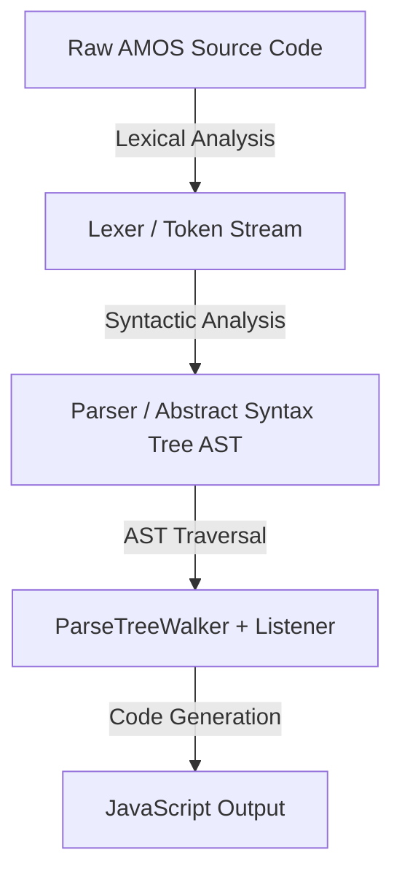

# AMOS Pro Grammar Specification

This document details the lexical analysis, grammatical structure, and parsing pipeline of the CRVJA project. It provides the necessary theoretical foundation and practical guidelines for developers and researchers extending the AMOS Pro transpiler.

---

## 1. Theoretical Foundation: Formal Grammars in CRVJA

To execute retro games written in AMOS Pro (a classic dialect of BASIC for the Commodore Amiga) within a modern, sandboxed web browser, CRVJA implements a **source-to-source compiler (transpiler)**. The compilation pipeline begins with a **front-end parser** guided by a Context-Free Grammar (CFG).

The grammar is specified using **ANTLR4** (ANother Tool for Language Recognition) in the grammar file [grammar/AMOS.g4](../grammar/AMOS.g4).

### The Compiler Front-End Pipeline


---

## 2. Lexical vs. Syntactic Analysis (ANTLR4)

ANTLR4 separates the language processing front-end into two distinct phases:

### A. Lexical Analysis (The Lexer)
The **Lexer** reads the raw AMOS source code as a stream of characters, groups them into semantically meaningful subsequences called **Tokens**, and discards irrelevant characters (like whitespace and comments).
* **Naming Convention**: Lexer rules in ANTLR4 must begin with an **uppercase letter** (e.g., `NUMBER`, `IDENTIFIER`, `COMMA`).
* **Example Lexer Rules** in [grammar/AMOS.g4](../grammar/AMOS.g4):
  ```antlr
  NUMBER: [0-9]+ ;
  IDENTIFIER: [a-zA-Z_][a-zA-Z0-9_]* '$'? ;
  COMMA: ',' ;
  ```

### B. Syntactic Analysis (The Parser)
The **Parser** consumes the token stream generated by the Lexer and matches it against grammatical rules to build an **Abstract Syntax Tree (AST)**, which represents the hierarchical syntactic structure of the program.
* **Naming Convention**: Parser rules in ANTLR4 must begin with a **lowercase letter** (e.g., `program`, `statement`, `cls`, `for_loop`).
* **Example Parser Rule**:
  ```antlr
  cls: 'Cls' ;
  ```

---

## 3. Lexical Control: Whitespace & Comment Skipping

In AMOS, developers can write spaces, tabs, or comments between expressions without affecting the meaning of the commands. To prevent the parser rules from becoming cluttered with optional whitespace rules, the lexer handles and discards these characters using the ANTLR `-> skip` directive.

* **Whitespace Skipping**:
  ```antlr
  WS: [ \t\n\r]+ -> skip ;
  ```
  This tells the lexer to automatically discard all spaces, tabs, and newlines from the token stream passed to the parser.
* **Comment and REM Skipping**:
  ```antlr
  COMMENT: '\'' ~[\n\r]* -> skip ;
  REM: 'Rem' ~[\n\r]* -> skip ;
  ```
  Single-quote comments and `Rem` blocks are matched and skipped, keeping the final AST clean and focused entirely on executable instructions.

---

## 4. Syntax and Operators of `AMOS.g4`

The [grammar/AMOS.g4](../grammar/AMOS.g4) file uses Extended Backus-Naur Form (EBNF) notation. The primary operators include:

### Key EBNF Operators
1. **Alternation (`|`)**: Defines a logical choice between different rules.
   ```antlr
   statement
       : curs_off
       | curs_on
       | cls
       ;
   ```
   A statement can match *exactly one* of the listed rules.
2. **Optional (`?`)**: Marks a rule or token as appearing zero or one times.
   ```antlr
   locate: 'Locate' NUMBER COMMA? NUMBER? ;
   ```
   This rule matches `Locate 10`, `Locate 10 20`, or `Locate 10, 20`.
3. **Repetition (`*` and `+`)**:
   * `*` (Kleene Star): Matches zero or more occurrences.
   * `+` (Kleene Plus): Matches one or more occurrences.
   ```antlr
   palette: 'Palette' (HEX_NUMBER COMMA?)* ;
   ```

---

## 5. Expression Parsing & Operator Precedence

Mathematical calculations in AMOS require strict arithmetic order of operations (e.g., multiplication and division must occur before addition and subtraction). ANTLR4 enforces this hierarchy by nesting parser rules:

```antlr
expression1:
    term ((ADD | SUBTRACT) term)*
    ;

term:
    SUBTRACT? factor ((MULTIPLY | DIVIDE) factor)*
    ;

factor:
    NUMBER
    | array_index_get
    | sin_function
    | cos_function
    | rndFunction
    | IDENTIFIER
    | '(' expression1 ')'
    ;
```

### How Precedence is Resolved
* When parsing `5 + 3 * 2`, the parser starts at `expression1`. It looks for addition/subtraction terms.
* `5` matches `term`, which goes down to `factor` and resolves to `NUMBER`.
* The `+` operator matches `ADD`.
* The next term is `3 * 2`. In `term`, the parser matches `3` (as a `factor`), then `*` (`MULTIPLY`), and `2` (as a `factor`).
* Because the multiplication rule (`term`) is nested deeper inside the addition rule (`expression1`), the resulting AST structure naturally evaluates the multiplication branch before performing the addition.

---

## 6. Case Study: The `Cls` Command

Let's dissect how a simple, parameterless command like `Cls` is integrated into the grammar.

### Step 1: Registering as a Statement
In `AMOS.g4`, the parser must know that `Cls` is a valid top-level command. This is done by adding the `cls` rule as an option in the main `statement` rule:
```antlr
statement:
    procedure
    | screen_open
    | curs_off
    // ...
    | cls
    // ...
    ;
```

### Step 2: Defining the Parser Rule
```antlr
cls:
    'Cls'
    ;
```
This rule dictates that when the lexer identifies the literal token `'Cls'`, it matches the `cls` parser rule. Because the rule contains no parameters, any code like `Cls 2` will fail syntax validation at this stage, throwing a syntax error.

---

## 7. Compiling the Grammar and Integrating Output

When the grammar file [grammar/AMOS.g4](../grammar/AMOS.g4) is compiled using Java, ANTLR4 translates the EBNF specifications into three JavaScript files inside [grammar/generated/](../grammar/generated/):

1. [AMOSLexer.js](../grammar/generated/AMOSLexer.js): Automatically groups the character input stream into structured tokens.
2. [AMOSParser.js](../grammar/generated/AMOSParser.js): Validates token structures and exposes the AST structure.
3. [AMOSListener.js](../grammar/generated/AMOSListener.js): Contains traversal hooks (e.g., `enterCls(ctx)`, `exitCls(ctx)`) invoked when walking the AST.

### Grammar Compilation Command
To regenerate the parser after editing `grammar/AMOS.g4`, execute the following from the root directory:
```bash
cd grammar
java -jar ../antlr-4.13.2-complete.jar -Dlanguage=JavaScript -o generated AMOS.g4
```
**Important**: Always make sure all project modules and test scripts import the lexer, parser, and listener files directly from the `/grammar/generated/` folder to ensure compatibility.
